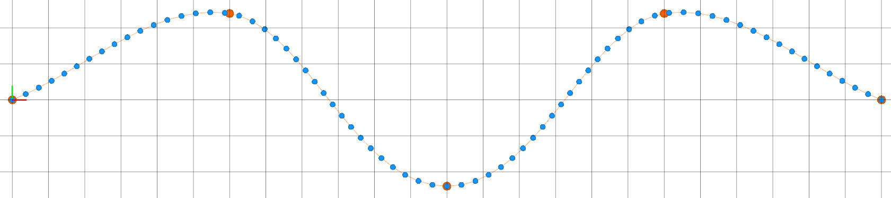
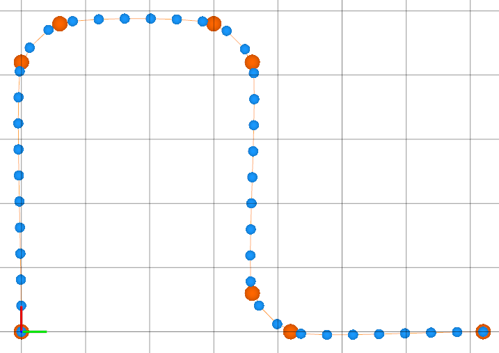
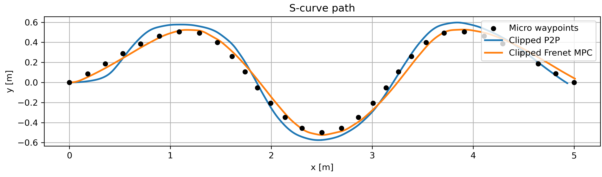
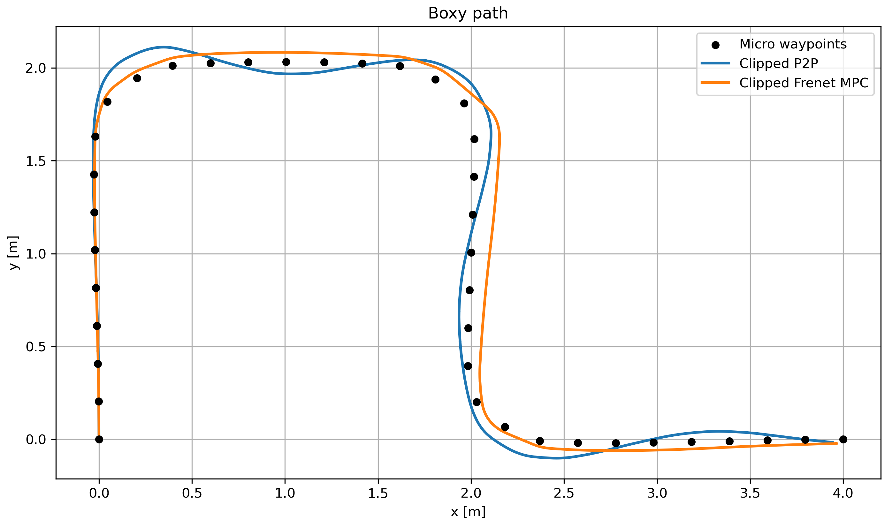
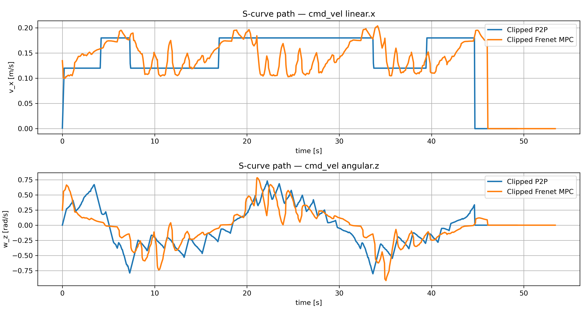
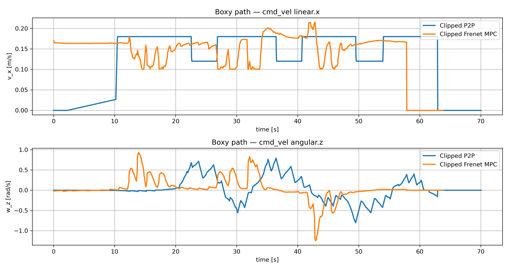

## Abstract

This paper presents a Frenet-frame model predictive motion controller for curvature-constrained skid-steer mobile robots. Skid-steer platforms are particularly sensitive to excessive curvature due to wheel slip and drivetrain stress, which makes curvature-aware motion control essential for reliable path following. The proposed controller operates in a path-local coordinate system and regulates lateral and heading errors with respect to a geometric reference path while explicitly accounting for curvature feasibility. To ensure a fair and consistent evaluation, a curvature-feasible path generation method is introduced, producing smooth reference paths and velocity profiles that respect yaw-rate limitations. The proposed Frenet-frame motion controller is compared against a curvature-clipped point-to-point baseline controller under identical constraints and reference paths. Experimental results on multiple types of trajectory demonstrate that the proposed approach achieves improved path tracking accuracy while reducing the average curvature demand and overall steering activity. The results indicate that Frenet-frame predictive motion control provides a robust and efficient solution for curvature-constrained path following on skid-steer mobile robots.

---

## Links

- 💻 **Code**: https://github.com/rudolfkrecht/frenet_skid_mpc
- 📊 **Dataset**: https://github.com/rudolfkrecht/frenet_skid_mpc/tree/main/datasets

---

## Method

  

     
    <em>S-curve path</em>
  

  

     
    <em>Boxy path</em>
  

---

## Results

  <video autoplay loop muted playsinline style="width:45%;" src="assets/S_path.mp4"></video>
  <video autoplay loop muted playsinline style="width:45%;" src="assets/Boxy_path.mp4"></video>

  

     
    <em></em>
  

  

     
    <em></em>
  

  

     
    <em>S-curve path </em>
  

  

     
    <em>Boxy path</em>
  

